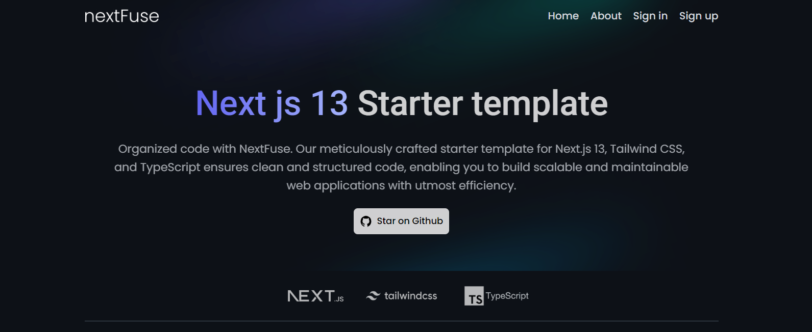

    

# SneakStreet - Front-End Sneaker Marketplace

SneakStreet is a dynamic front-end e-commerce platform designed for sneaker enthusiasts. Crafted with Next.js, TypeScript, Tailwind CSS, and powered by Framer Motion for animations and parallax effects, this project offers an immersive web development experience.

## Key Features for Developers

- **Next.js**: Utilize the power of Next.js for server-side rendering, routing, and optimized performance.
- **TypeScript**: Enhance code quality and maintainability with static typing.
- **Tailwind CSS**: Quickly style your components with utility-first CSS.
- **Framer Motion**: Create stunning animations and parallax effects to captivate users.
- **API Integration**: Learn how to integrate external APIs to fetch and display sneaker data.
- **Responsive Design**: Ensure your web application looks great on various screen sizes.
- **UI Components**: Explore reusable UI components for a consistent user interface.
- **Client-Side Routing**: Implement client-side routing for a smooth user experience.
- **State Management**: Choose and implement state management solutions as needed.

## Getting Started

To get started with SneakStreet, follow these steps:

1. Clone this repository to your local machine.
2. Install the required dependencies using `npm install` or `yarn install`.
3. Customize and extend the project according to your requirements.
4. Explore the codebase to learn from the implementation of key features.
5. Run the development server with `npm run dev` or `yarn dev` to see SneakStreet in action.

## Contributing

We welcome contributions from the community. If you have ideas for improvements or new features, please open an issue or submit a pull request.

---

SneakStreet is your canvas for creativity and innovation in web development. Build amazing front-end experiences with animations, parallax effects, and more. Happy coding!
